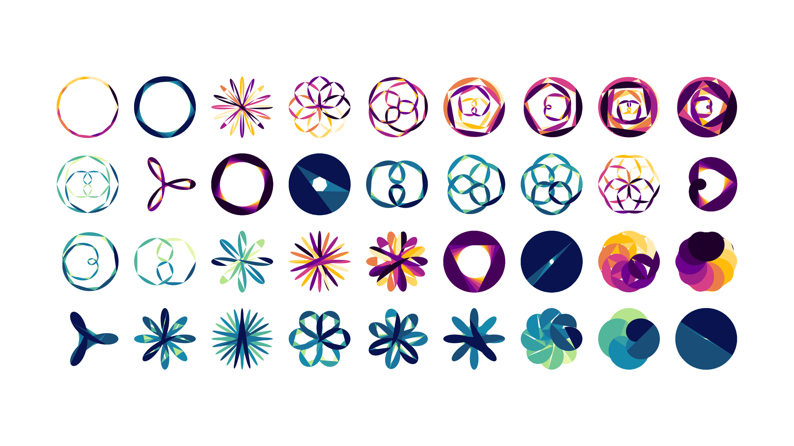

# Rose curves generator

A JavaScript implementation of a rose curves generator. A rose or rhodonea curve is a sinusoid plotted in polar coordinates. View demo here: [codepen.io](https://codepen.io/mnbond/full/RNwXavw).

The idea of color polygon plots based on this [post](https://art-verse.com/2020/04/04/algorithmic-art-rose-rhodonea-curves/).



## Instructions

1. Add JavaScript code containing class `Rose` in an HTML document:

    ```html
    <script src="js/rose.js" type="text/javascript"></script>
    ```

2. Add HTML element for a rose curve in `body` section:

    ```html
    <div id="rose"></div>
    ```

3. Сreate an instance of class `Rose` after the `DOMContentLoaded` event:

    ```js
    document.addEventListener("DOMContentLoaded", () => {
        rose = new Rose("rose", 20, 10, 1, 360, 0, 24, 1, "palette-1");
    });
    ```

    Class `Rose` constructor parameters:
    - `containerId` — ID of HTML element for the rose curve;
    - `frameDurationMs` — frame duration in milliseconds;
    - `stepPerFrame` — number of steps per frame;
    - `k` — angular frequency (n / d);
    - `loopSizeDeg` — total size of the curve in degrees;
    - `startAngleDeg` — initial angle in degrees;
    - `polygonSizeDeg` — polygon size in degrees;
    - `polygonPerGroup` — number of polygons of the same color;
    - `palette` — class name of the palette.
